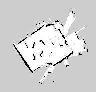

# Mobile Robot Navigation Experiments

This repository provides sample implementations for tasks **3-4**, **3-5**, and **3-7** using the ROS 2 Nav2 Simple Commander API, demonstrated on a custom-generated occupancy grid map.

---

## Map Overview

Below is the occupancy grid map created for these experiments. Free space is white, obstacles are black, and unknown areas are gray.



---

## Repository Contents

- **`navigate_waypoints.py`** (Task 3-4): Navigate through a predefined sequence of waypoints and align to specified orientations.
- **`obstacle_aware_navigation.py`** (Task 3-5): Check for obstacles at each waypoint and skip any locations that are blocked.
- **`push_object_transport.py`** (Task 3-7): Navigate to an object, rotate to face the delivery target, and push the object along a straight line to its destination.
- **`map.png`**: The occupancy grid map used in all navigation tasks.

---

## Requirements

- **ROS 2** (e.g., Foxy, Galactic, Humble)
- **nav2_simple_commander** package
- **geometry_msgs**, **rclpy**
- A compatible robot platform with Nav2 (e.g., TurtleBot3)

---

## Launch Instructions

1. **Start Nav2 with your map**

   ```bash
   ros2 launch turtlebot3_navigation2 navigation2.launch.py map:=map.yaml
   ```

2. **Run each script in a new terminal**

   - Navigate waypoints:

     ```bash
     ros2 run <your_package> navigate_waypoints.py
     ```

   - Obstacle-aware navigation:

     ```bash
     ros2 run <your_package> obstacle_aware_navigation.py
     ```

   - Push object transport:

     ```bash
     ros2 run <your_package> push_object_transport.py
     ```

---

## Task 3-4: Sequential Waypoint Navigation

In `navigate_waypoints.py`, the robot:

1. Initializes its starting pose (set to `[0,0]` facing +X by default).
2. Visits each waypoint in the defined list `[(x, y, yaw), ...]`.
3. At each waypoint, aligns to the specified `yaw` (orientation around the Z-axis).

**Key API calls**:

- `goThroughPoses()`
- `isTaskComplete()` / `getResult()`

---

## Task 3-5: Obstacle-Aware Navigation

In `obstacle_aware_navigation.py`, the robot:

1. Reads each target waypoint.
2. Queries the global costmap at that `(x, y)` location.
3. If `cost > 0` (obstacle) or out of range, skips the waypoint.
4. Otherwise, calls `goToPose()` and monitors progress.

**Key API calls**:

- `getGlobalCostmap()`
- `worldToMapValidated()` / `getCostXY()`
- `goToPose()`

---

## Task 3-7: Object Pushing and Transport

In `push_object_transport.py`, the robot:

1. Navigates to the object’s location.
2. Computes the heading `yaw` towards the destination.
3. Uses `spin(yaw)` to rotate in place.
4. Drives straight with `driveOnHeading(distance, speed)` to push the object.

**Key API calls**:

- `goToPose()`
- `spin()`
- `driveOnHeading()`

---

## License

This project is licensed under the Apache License 2.0. See [LICENSE](LICENSE) for details.
